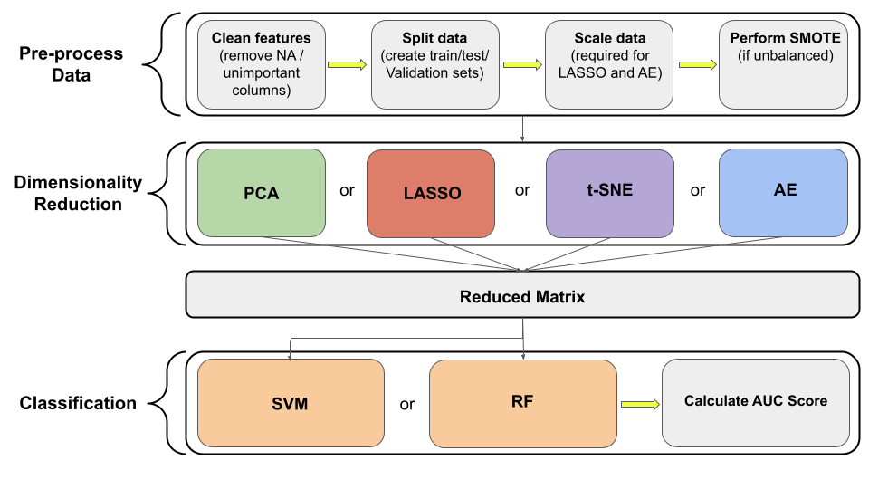

# microbial-steen-project

This project consists of code to implement dimensionality reduction combined with machine learning classification. Specifically, we have implemented a pipeline for using autoencoders/LASSO/PCA/tSNE with either SVM/Random Forests. We test our code using the preload datasets that can be found in files/data and which are loaded in scripts/preload.py.

Our pipeline is implemented as follows:

To run our pipeline, please refer to the documentation (run **python3 scripts/driver.py --help** for more information.)

Our code has been thoroughly tested to run on Linux using our preloaded datasets. If you would like to run our pipeline with a preloaded dataset, please make sure to extract it from the archive before running.

*Note: We highly recommend you run our code on a server. These models can be computationally intensive. Memory/computational power on standard laptops/machines will likely be insufficient.*

Currently in progress:
- Adding functionality for loading custom datasets
- Creating example custom dataset
- Adding functionality for specification of custom grid search parameters per model
- Creating Linux/Windows/Mac executable versions of the codebase
- Creating auto scripts to run entire model pipeline with standard parameters
- Other bug fixes
